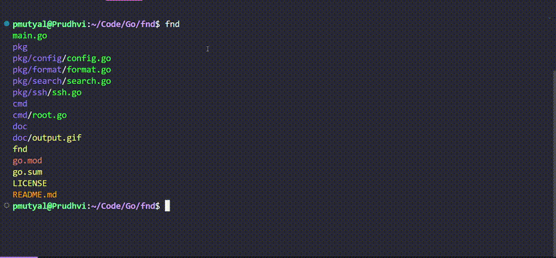

<div align="center">

# fnd

</div>

`fnd` is a versatile, intuitive file search utility for both local and remote environments. Inspired by [fd](https://github.com/sharkdp/fd), this tool builds on fd’s functionality by adding remote search capabilities, making it particularly useful for locating container logs or analyzing distributed file structures.

Implements parallel directory traversal. 


## Features

- **Simple, intuitive syntax**: Search effortlessly with `regex` patterns.
- **Local & remote search**: Go beyond the local file system to locate files on remote servers.
- **Remote search**: *(Under Maintenance)* Search capabilities for remote servers and containers.

## Demo

<div align="center">
  
</div>


## Installation

To install `fnd`, clone the repository and build the project. Ensure Go is installed:

```bash
# Clone the repository
git clone https://github.com/prudhvideep/fnd

# Navigate to the directory
cd fnd

# Build the project
go build -o fnd
